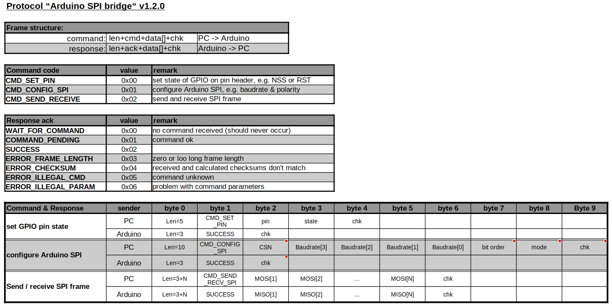

# Overview

_Arduino_SPI_bridge_ is a small Arduino project to configure an Arduino as USB<->SPI gateway. The main objective for this project was to provide a OS-independent SPI-gateway for the [_stm8gal_](https://github.com/gicking/stm8gal) application. However, since the SPI can be freely configured, it should also work for other SPI slave devices.

Basically _Arduino_SPI_bridge_  is remotely controlled via USB command using a simple UART protocol (for details see 'protocol.ods'). So far it has only been tested with an Arduino UNO R3, but there should be no major issue porting it to other ATMega boards. However, due to the used [NeoHWSerial](https://github.com/SlashDevin/NeoHWSerial) library, which currently does not support the newer ARM-based Arduinos. 

To test the functionality, a small Python project is also provided. Provided that Python and PySerial are installed, it should be compatible with Windows, MacOS X and Linux, including Raspbian.

For bug reports or feature requests please send me a note.

Have fun!
Georg

***

# License / Disclaimer
- _Arduino_SPI_bridge_ and it's source code is distributed under the Apache License Version 2.0 (see [License](LICENSE))

***

# Building the Software

Open 'SPI_bridge/SPI_bridge.ino' in the Arduino IDE, build and upload to the Arduino board. If required, install [NeoHWSerial](https://github.com/SlashDevin/NeoHWSerial) first.

***

# Using the Software

_Arduino_SPI_bridge_ waits for commands via USB and reacts accordingly. Frame syncronization is via inter-frame time (>1ms). The simple command and response protocol is (also see 'protocol.ods') 

 
  

An example of protocol and possible error handling is given in 'Arduino_SPI_bridge.py'. This file can also be imported into bigger Python programs.

***

# General Notes

- before connecting different devices, please assert compatible voltage levels. Specifically, to avoid damage **never expose a 3.3V device to 5V signals**
  
***

# Known Issues / Limitations

- limitation to ATMega-based Arduino boards due to the used [NeoHWSerial](https://github.com/SlashDevin/NeoHWSerial) library, which currently does not support ARM-based Arduinos. 

***

# Revision History

v1.0.1 (2017-12-22)
  - fixed bug in conjunction with stm8gal (see https://github.com/gicking/stm8gal)

----------------

v1.0.0 (2017-12-21)
  - initial release by Georg Icking-Konert under the Apache License 2.0

